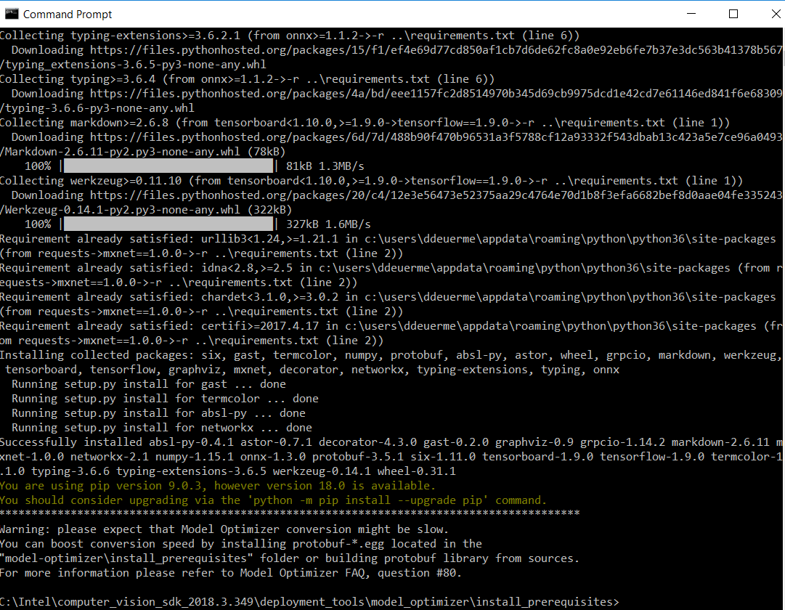

# Практика 2. Детектирование объектов с использованием глубоких моделей

## Цели

__Цель данной работы__ - решить задачу детектирования объектов, используя
модуль Inference Engine инструмента Intel Distribution of OpenVINO toolkit.
Предполагается работа с обученными нейронными сетями.

## Структура исходного кода

  1. В директории `src` расположен файл `ie_detector.py`, который содержит 
  объявление класса `InferenceEngineDetector`, обеспечивающий детектирование 
  объектов с использованием модели `mobilenet-ssd`.
  1. В директории `samples` расположен файл `practice2_template.py`, в котором 
  представлена функция `main` - точка входа в программу.

## Задачи

__Основные задачи:__

  1. Скачать модель для детектирования объектов [mobilenet-ssd][mobilenetssd] 
     и сконвертировать модель в промежуточное представление (intermediate
     representation), которое принимается Inference Engine.
  1. Реализовать класс InferenceEngineDetector, который инициализирует 
     Inference Engine, загружает модель и выполняет вывод модели. 
  1. Разработать приложение для детектирования объектов на изоражениях
     с использованием загруженной модели.
  1. Реализовать вывод изображения на экран и отрисовку прямоугольников,
     окаймляющих объекты.
  
__Дополнительные задачи:__

  1. Реализовать запись видео с прямоугольниками, окаймляющими объекты, в файл.
  1. Попробовать другие модели для детектирования объектов, доступные
     в [Open Model Zoo](https://github.com/opencv/open_model_zoo).
  
## Общая последовательность действий

 1. Скачать обученную модель [mobilenet-ssd][mobilenetssd] с помощью
    инструмента Model Downloader.
 1. Конвертировать скачанную модель с помощью инструмента Model Optimizer.
 1. Разработать класс `InferenceEngineDetector` для решения задачи
    детектирования объектов.

    - Реализовать конструктор класса `InferenceEngineDetector`, включающий
      инициализацию необходимых параметров.
    - Реализовать метод `_prepare_image` для преобразования изображения
      в формат входа модели.
    - Реализовать метод `detect` для детектирования объектов.
    - Реализовать метод `output_detection` для отображения получившегося
      результата на входном изображении.
          
 1. Реализовать программу которая будет использовать класс `InferenceEngineDetector`
    для детектирования объектов.
 1. Выполнить [дополнительные задачи][addtasks].

## Детальная инструкция по выполнению работы

### Подключение пакета Intel Distribution of OpenVINO toolkit

Для того, чтобы пользоваться всеми возможностями Intel Distribution
of OpenVINO toolkit, необходимо выполнить установку при помощи установочного
файла и выполнить настройку Model Optimizer для конвертации моделей.
Оригинальная инструкция на английском языке доступна по [ссылке][install].

 1. Открыть командную строку Anaconda и активировать виртуальную среду, 
    созданную на [практике 1][practice1].

 1. Для работы с OpenVINO в командной строке Python необходимо 
    запустить скрипт `setupvars.bat`, который подключит все зависимости OpenVINO
    в переменные среды системы.
 
    ```bash
    $ "C:\Program Files (x86)\IntelSWTools\openvino\bin\setupvars.bat"
    ```

 1. Для настройки Model Optimizer необходимо запустить скрипт 
    `install_prerequisites.bat`, который установит все требуемые библиотеки.
 
    ```bash
    $ cd "C:\Program Files (x86)\IntelSWTools\openvino\deployment_tools\model_optimizer\install_prerequisites"     
    $ install_prerequisites.bat
    ```
        
    В консоли должны появиться сообщения, аналогичные представленным.
        
    

 1. Не закрывайте текущую командную строку. Если вы закроете ее, то вам
    придется заново активировать виртуальную рабочую среду и запустить скрипт 
    `setupvars.bat`.

### Скачивание и конвертация модели при помощи инструментов Model Dowloader и Model Optimizer
        
 1. В директории `<openvino_dir>/deployment_tools/tools/model_downloader` 
    запустить скрипт `downloader.py` с параметрами
    `--name mobilenet-ssd --output_dir <destination_folder>`.

    ```bash
    $ python "C:\Program Files (x86)\IntelSWTools\openvino\deployment_tools\tools\model_downloader\downloader.py" --name mobilenet-ssd --output_dir <destination_folder>
    ```  
 
 1. В директории `<openvino_dir>/deployment_tools/tools/model_downloader/` 
    запустить скрипт `converter.py` с параметрами
    `--name mobilenet-ssd --download_dir <destination_folder>`.
 
    ```bash
    $ python "C:\Program Files (x86)\IntelSWTools\openvino\deployment_tools\tools\model_downloader\converter.py" --name mobilenet-ssd --download_dir <destination_folder>
    ``` 

### Создание класса `InferenceEngineDetector`
 
 1. Создать рабочую ветку `practice-3` ( см. [Практика1][practice1]).
 1. В файле `src/ie_detector.py` реализовать конструктор класса `InferenceEngineDetector`. 
    Конструктор получает следующие параметры:

      1. Путь до xml-файла модели.
      1. Путь до bin-файла модели.
      1. Тип устройства, на котором запускаемся (CPU или GPU).
      1. Для CPU необходим путь до библиотеки со слоями, реализации которых нет в MKL-DNN
      (например `<openvino_dir>\inference_engine\bin\intel64\Release\cpu_extension_avx2.dll`).
      
    Конструктор выполняет следующие действия: 
      
      1. Создание объекта класса `IECore`.
      1. Установка типа устройства для запуска и путь до расширенной библиотеки слоев.
      1. Создание объекта класса `IENetwork` с параметрами - путями до модели.
      1. Загрузка созданного объекта класса `IENetwork` в `IECore`.
      
 1. В файле `src/ie_detector.py` реализовать метод подготовки изображения `_prepare_image`.
    Особенностью обработки изображений глубокими моделями отличается от 
    обработки изображений классическими алгоритмами тем, что сети 
    принимают изображения поканально, а не попиксельно, изображения в подаваемой пачке
    необходимо преобразовать из формата RGBRGBRGB в формат RRRGGGBBB. Для этого можно 
    воспользоваться функцией `transpose`.

    ```python
    image = image.transpose((2, 0, 1)) 
    ```

    Также необходимо уменьшить или увеличить размер изображения до размера входа сети
 
 1. В файле `src/ie_detector.py` реализовать метод подготовки изображения 
    `detect`, который запускает исполнение глубокой модели на устройстве,
    указанном в конструкторе. Логика работы функции `detect` следующая:
       
    1. Получить данные о входе и выходе нейронной сети.

       ```python
       input_blob = next(iter(self.net.inputs))
       out_blob = next(iter(self.net.outputs))
       ```
       
    1. Из данных о входе нейронной сети получить размеры выходного изображения.
       
       ```python
       n, c, h, w = self.net.inputs[input_blob].shape
       ```   
       
    1. С помощью функции `_prepare_image` сконвертировать картинку.
    1. Написать функцию синхронного вывода модели.
       
       ```python
       output = self.exec_net.infer(inputs = {input_blob: blob})
       ``` 
       
    1. Из выхода модели получить тензор с результатом детектирования.
    
       ```python
       output = output[out_blob]
       ```

    1. Выполнить функцию `_output_detection`, для того чтобы нарисовать результат
       детектирования на изображении.
       
 
 1. В файле `src/ie_detector.py` реализовать метод подготовки изображения
    `_output_detection`.


Выходом модели mobilenet-ssd является тензор (1x1x100x7), в котором каждая
строка содержит следующие параметры: [image_number, classid, score, left, bottom, right, top],
где image_number - номер изображения (у нас всегда 0, так как мы подаем одно изображение);
classid - номер класса; score - вероятность объекта в данном месте;
left, bottom, right, top - координаты ограничивающих прямоугольников в диапазоне от 0 до 1.
Необходимо отрисовать эти прямоугольники на основном изображении.
Подробный пример работы с моделью moilenet-ssd при помощи OpenCV
на языке Python можно посмотреть [по ссылке][opencv_dnn_detect]. 
  
### Использование класса `InferenceEngineDetector` 

 1. Создать копию файла `<project_source>/samples/practice2_template.py`
    и назвать ее `<project_source>/samples/practice2_YOUR_NAME.py`.
 1. Добавить чтение необходимых аргументов командной строки по аналогии
    с [практикой 1][practice1].
 1. Создать объект класса `InferenceEngineDetector` и передайте ему
    все необходимые параметры.
 1. Прочитать изображение, вызвать функцию `detect` объекта класса
    `InferenceEngineDetector` для того, чтобы детектировать все объекты
    на изображении.
 1. Вывести полученное изображение на экран или в файл.
 1. Реализовать дополнительный функционал: если на вход приложению не был
    подан путь до изображения, использовать изображение с веб-камеры.
  
<!-- LINKS -->
[mobilenetssd]: https://github.com/chuanqi305/MobileNet-SSD
[install]: https://docs.openvinotoolkit.org/latest/_docs_install_guides_installing_openvino_windows.html
[addtasks]: practice2.md#Задачи
[practice1]: practice1.md
[opencv_dnn_detect]:https://ebenezertechs.com/mobilenet-ssd-using-opencv-3-4-1-deep-learning-module-python/
